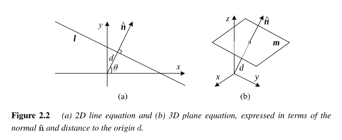
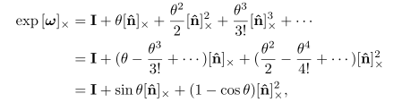

**Image Formation**

- 2.1)
  - Geometric primitives
    - Points, Lines, and Planes
  - Geometric Transformations
    - Project 3D quantities into 2D image features
  - homogeneous coordinates have a ~ over them
  - cross product operator in matrix from denoted by $[ ]_x$
- 2.2)
  - How Lighting, surface properties, and camera optics interact to produce color values that fall
    onto the image sensor
- 2.3)
  - How continuous color values are turned into discrete digital samples inside the image sensor
  - Color theory is a thing and exists lol
  - Active illumination systems?

# 2.1) Geometric primitives and transformations

- Basic 2D and 3D primitives
  - Points, lines, and planes
- How 3D features projected into 2D features

## 2D Points

<!-- line break in markdown is 2+ spaces at the end of a line -->
[good link for markdown vscode math notation](https://www.upyesp.org/posts/makrdown-vscode-math-notation/)  
[extended markdown guide](https://www.markdownguide.org/extended-syntax/)

- One way of denoting points in 2D space
  <!-- \ldots for three dots in latex -->
  - Use $\mathit{(x_1, x_2, \ldots)}$ notation for column vectors
$$\textbf{x} = \begin{bmatrix}x\cr y\end{bmatrix}$$

- 2D points can be represented using homegeneous coordinates
  - What are homogeneous coordinates
    - System in projective geometry
    - Allows points, including those at infintiy, to be represented using finite coordinates
      - Not 3D???
      - Points with $w = 0$ lie at infinity
        - All points that lie along a line with this direction will **converge to this point at infinty** in projective space
        - I like to think about this as a line/plane that goes/expands to infinity
    - [youtube video explanation](https://youtu.be/JSLG8n_IY9s?si=EhkGYZt5mLzrqrtj)
      - Represent coordinates in 2D with a 3-Vector
      $$\begin{bmatrix}x\cr y\end{bmatrix} \Rightarrow \begin{bmatrix}x\cr y\cr w\end{bmatrix}$$
      - Adding a third coordinate for every 2D point
        - (x, y, w) => (x/w, y/w)
        - Arbitrary (x, y, 1) vector named *augmented vector*
        - For example:
          - 2D space at coordinate (2, 1)
          - Equivalent homogeneous coordinates: (2, 1, 1) | (4, 2, 2) | (6, 3, 3)
            - (2, 1, 1) = (4 / 2, 4 / 2)
            - w = 2 in this scenario
      - w can never be 0
        - (x, y, 0) => infinity (named *ideal points* or *points at infinity*)
      - (0, 0, 0) is not allowed

## 2D lines

- 2D lines can also be represented with homegenous coordinates
  - line of: $\text{\textbf{\~l}} = (a, b, c)$
    - corresponding line equation: $\mathbf{\bar{x}} ⋅ \textbf{\~l} = ax + by + c = 0$
      - Guessing c is multiplied by 1 here always so doesn't change
        - Lines up with the w value from above for the augmented vector
  - Normalize line equation vector so: $\text{\textbf{l}} = (\^{n}_x, \^{n}_y, d) = (\mathbf{\^{n}}, d)$ with $\left\|\mathbf{\^{n}}\right\| = 1$
    - $\mathbf{\~{n}}$ is the normal vector perpendicular to the line
    - $d$ is distance to origin
    - One exception: $\text{\textbf{\~{l}}} = (0, 0, 1)$ which includes all *ideal points* at infinity

  - Express $\left\|\mathbf{\^{n}}\right\|$ as a rotation function of $\theta$
    - $\left\|\mathbf{\^{n}}\right\| = (\^{n}_x, \^{n}_y) = (cos \theta, sin \theta)$
    - Commonly used in *Hough transform* line-finding algorithm
    - Basically just polar coordinates
  - Compute intersection of two lines as: $\mathbf{\~{x}} = \mathbf{\~{l}}_1\times\mathbf{\~{l}}_2$
    - $\times$ is cross product operator
  - Line joining two points as: $\mathbf{\~{l}} = \mathbf{\~{x}}_1\times\mathbf{\~{x}}_2$

## 2D Conics

- Curves can be represented by homogeneous equations
  - Conic sections (intersection of plane and 3D cone) can be written with a *quadric* equation
  - Quadrics
    - Generalization of conic sections (ellipses, parabolas, and hyperbolas)
    
    - That's all they are
      - Ellipses
      - Circles
      - Parabolas
      - hyperbolas
    - Equation: $\mathbf{\~{x}}^T\mathbf{Q\~{x}} = 0$
      - What does Q mean??
    - Useful in study of multi-view geometry and camera calibration
      - Not used too much in this book
      - So much so they didn't explain Q

## 3D Points

<!-- \mathbb{*letter*} for mathified symbol -->
- inhomogeneous coordinate system: $\mathbf{x} = (x, y, z) \isin \R^{3}$
- homogeneous coordinate system: $\mathbf{\bar{x}} = (\~{x}, \~{y}, \~{z}, \~{w}) \isin \mathbb{P}^{3}$
- Sometimes useful to denote 3D point using augmented vector $\mathbf{\~{x}} = (x, y, z, 1)$ with $\mathbf{\~{x}} = \mathit{\~{w}}\mathbf{\bar{x}}$
  - Seems like $\~w$ is just gonna be 1 here

## 3D Planes

- homogeneous coordinates $\mathbf{\~m} = (a, b, c, d)$
  - corresponding plane equation: $\mathbf{\bar{x}} ⋅ \mathbf{\~m} = ax + by + cz + d = 0$
- This is basically the same as the `2D Plane` section. Go look at that but in 3D
  - Check out the 3D graphic up there too
  - The normalized **m** and $\mathbf{\^n}$ magnitude are basically the same
- Spherical coordinates: $\mathbf{\^n} = (\cos\theta\cos\phi, \sin\theta\cos\phi, \sin\phi)$
  - Less common than polar coordinates since they don't uniformly sample the space of possible normal vectors

## 3D Lines

- Less elegant than 2D lines or 3D planes
- One possible representation to use two points on the line (**p**, **q**)
  - Named the endpoint representation
  - Any other point on the line can be expressed as a combination of these two
  - $\mathbf{r} = (1 - \lambda)\mathbf{p} + \lambda\mathbf{q}$
    - if restrict $0 \le \lambda \le 1$, get *line segment* joining **p** and **q**
    
    - looks r is just a point on the line
    - all possible values of r in this range gives the segment
- If homogeneous coordinates:
  - Write line as: $\mathbf{\~r} = \mu\mathbf{\~p} + \lambda\mathbf{\~q}$
    - What is $\mu$ here??
      - Gonna guess its $1 - \lambda$
  - A special case when the second point is an infinity
    - $\mathbf{\~q} = (\^d_x, \^d_y, \^d_z, 0) = (\mathbf{\~d}, 0)$
      - $\mathbf{\^d}$ is direction of the line
    - Can re-write as: $\mathbf{r} = \mathbf{p} + \lambda\mathbf{\^{d}}$
  - Problem: too many degress of freedom
    - 6 for each endpoint rather than 4 that a 3D line has
    - If fix two points on line to lie in specific planes, have representation with 4 degress of freedom
    - For example: If representing nearly vertical lines
      - $z = 0$ and $z = 1$ form two suitable planes
        - $(x, y)$ coordinates in both planes provide the four coordinates describing the line
    - This sort of two-plane parameterication used in *light field* and *Lumigraph* image-based rendering systems

- If wish to represent all possible lines without bias towards any particular orientation, use *Plicker coordinates*
  - Talked more about in Chapter 3
  - Coordinates are 6 independent non-zero entries in 4x4 symmetric matrix
  $$\mathbf{L} = \mathbf{\~p\~q}^T - \mathbf{\~q\~p}^T$$
  - $\mathbf{\~p}$ and $\mathbf{\~q}$ are any two (non-identical) points on the line
  - 4 degrees of freedom since **L** homogeneous and satisfies $\left|\mathbf{L}\right| = 0$
    - Results in quadratic constraint on Plucker coordinates
  
## 3D Quadrics

<!-- https://www.mathsisfun.com/definitions/analog.html -->
- 3D analog of conic section is a quadric surface
  - Analog being something physical with continuous change
  $$\mathbf{\bar{x}}^T\mathbf{Q\bar{x}} = 0$$
  - Good in the study of multi-view geometry

# 2.1.1) 2D transformations

- Translation
  - Written as: $x' = x + t$ or
  $$x' = \begin{bmatrix}\mathbf{I}&\mathbf{t}\end{bmatrix} \mathbf{\bar{x}}$$
  - **I** is (2x2) identity matrix or
  $$\bar{x}' = \begin{bmatrix}\mathbf{I}&\mathbf{t}\cr\mathbf{0}^T&1\end{bmatrix}\bar{x}$$
  - **0** is zero vector
  - In any equation where an augmented vector ($\bar{x}$) appears on both sides, can be replaced with a full homogeneous vector $\bar{x}$
- Rotation + Translation
  - Also known as rigid body motion or 2D Euclidean transformation
  - $\mathbf{x}' = \mathbf{Rx} + \mathbf{t}$ or
  $$\mathbf{x}' = \begin{bmatrix}\mathbf{R}&\mathbf{t}\end{bmatrix}\mathbf{\bar{x}}$$
  where
  $$\mathbf{R} = \begin{bmatrix}\cos\theta&-\sin\theta\cr\sin\theta&\cos\theta\end{bmatrix}$$
  is an orthonormal rotation matrix with $\mathbf{RR}^T = \mathbf{I}$ and $\left|\mathbf{R}\right| = 1$
    - Definition of **orthogonal matrix** or **orthonormal matrix**:
      - Pulled from [wikipedia](https://en.wikipedia.org/wiki/Orthogonal_matrix)
      - Real square matrix whose columns and rows are orthonormal vectors
      - Two vectors othonormal if orthogonal unit vectors
        - unit vectors meaning vector has length of 1
        - orthogonal is another word for perpendicular
- Scaled Rotation
  - Also known as *similarity transform*
  - $\mathbf{x}' = s\mathbf{Rx} + \mathbf{t}$
    - *s* is an arbitrary scale factor
    - Also written as:
    $$\mathbf{x}' = \begin{bmatrix}s\mathbf{Rx}&\mathbf{t}\end{bmatrix}\mathbf{\bar{x}} = \begin{bmatrix}a&-b&t_x\cr b&a&t_y\end{bmatrix}\mathbf{\bar{x}}$$
    - No longer required $a^2 + b^2 = 1$
    - Similarity transform preserves angles between lines
- Affine Transformation
  - Heard of this before
  - $\mathbf{x}' = \mathbf{A\bar{x}}$ where $\mathbf{A}$ is an arbitrary 2 x 3 matrix
  - For example:
  $$\mathbf{x}' = \begin{bmatrix}a_{00}&a_{01}&a_{02}\cr a_{10}&a_{11}&a_{12}\end{bmatrix}\mathbf{\bar{x}}$$
- Projective Transformation
  - A **GUESS**: projects into a different dimension
  - Also known as: *perspective transform* or *homography*
  - Operates on homogenous coordinates
  $$\mathbf{\~{x}' = \~{H}\~{x}}$$
    - Where $\mathbf{\~H}$ is an arbitary 3 x 3 matrix
    - Note: $\mathbf{\~H}$ is homogeneous
      - Only defined up to scale and that two $\mathbf{\~H}$ matricies that differ only by scale are equivalent
      - Resulting $\mathbf{\bar{x}'}$ must be normalized to obtain an inhomogeneous result $\mathbf{x}$
        - For example:
        $$x' = \frac{h_{00}x + h_{01}y + h_{02}}{h_{20}x + h_{21}y + h_{22}}$$ and $$y' = \frac{h_{10}x + h_{11}y + h_{12}}{h_{20}x + h_{21}y + h_{22}}$$
  - Preserve straight lines (remain straight after transformation)
- Heirarchy of 2D transformations
  
  
  - Think of as set of (potentially restricted) 3 x 3 matricies operating on 2D homogeneous coordinate vectors
  - Above transformations form a nested set of *groups*
    - Closed under composition and have inverse that is a member of the same group
      - Composition: $f(g(x))$
      - [Closed Definition](https://en.wikipedia.org/wiki/Closure_(mathematics)): A subset of a given set is closed under an operation if performing an operation on members of the subset always produce a member of that subset
        - For example: [natural numbers](https://en.wikipedia.org/wiki/Natural_number) are closed in addition but not under subtraction
          - `1 - 2 = -1` is not a natural number although 1 and 2 are
  - Each (simpler) group is a subgroup of the more complex group below it
    - Named *Lie group(s)*
    - Used in robotics
      - 2D rotation and rigid transforms called SO(2) and SE(2)
        - Stand for *special orthogonal* and *special Euclidean* groups
        - *special* refers to desired condition of **no** reflection i.e. det $\left|\mathbf{R}\right| = 1$
        - [Reflection](https://en.wikipedia.org/wiki/Reflection_(mathematics)): A mapping from a space to iself (no dimension change)
        
- Co-vectors
  - Above transformations can also be used to transform a line equation
  - Consider homogeneous transformation: $\mathbf{\~l}$ · $\mathbf{\~x} = 0$
    - If transform $\mathbf{\~{x}' = \~{H}\~{x}}$, obtain:
    $$\mathbf{\~l}' \cdot \mathbf{\~x}' = \mathbf{\~l}'^T(\mathbf{\~{H}\~{x}})^T\mathbf{\~{x}} = \mathbf{\~l} \cdot \mathbf{\~x} = 0$$
      - For exmaple: $\mathbf{\~I}' = \mathbf{\~H}^{-T}\mathbf{\~l}$
        - Where *-T* takes the transpose and inverses the matrix
  - The action of a projective transformation on a co-vector such as a 2D line or 3D normal can be represented by transposed inverse of the matrix
    - Equivalent to *adjoint* of $\mathbf{\~H}$
    - [Adjoint](https://en.wikipedia.org/wiki/Adjugate_matrix): Transpose of cofactor matrix
    - Can find [cofactors](https://en.wikipedia.org/wiki/Minor_(linear_algebra)#Inverse_of_a_matrix) with [Cramer's Rule](https://en.wikipedia.org/wiki/Cramer%27s_rule)
    - Cramer's Rule: explicit formula for solution of a system of linear equations
- Strech/squash transformation
  - Changes aspect ratio of an image
  - $x' = s_xx + t_x$ and $y' = s_yy + t_y$
  - A restricted form of an affine transformation
- Planar surface flow
  - I really can just do this for fun
  - 8 parameter transformation
  - $x' = a_0 + a_1x + a_2y + a_6x^2 + a_7xy$ and $y' = a_3 + a_4x + a_5y + a_6xy + a_7y^2$
  - Arises when a planar surface undergoes a small 3D motion
    - Small motion approximation to a full homography
  - Linear in the motion parameters
- Bilinear interpolant
  - 8 parameter transform
  - $x' = a_0 + a_1x + a_2y + a_6xy$ and $y' = a_3 + a_4x + a_5y + a_7y^2$
  - Interpolate deformation due to motion of four corner points of a square
    - Can interpolate motion of any four non-collinear points
      - [collinearity](https://en.wikipedia.org/wiki/Collinearity): Set set of points on a line are said to be collinear

# 2.1.2) 3D Transformations
  - Very similar to 2D transformations
  - As in 2D, these transformations form a nested set of groups
  

- Translation
  - Written as: $x' = x + t$ or
  $$x' = \begin{bmatrix}\mathbf{I}&\mathbf{t}\end{bmatrix} \mathbf{\bar{x}}$$
  - **I** is (3x3) identity matrix
- Rotation + Translation
  - Also known as *3D rigid body motion* or *3D Euclidean transformation* or SE(3)
  - $\mathbf{x}' = \mathbf{Rx} + \mathbf{t}$ or
  $$\mathbf{x}' = \begin{bmatrix}\mathbf{R}&\mathbf{t}\end{bmatrix}\mathbf{\bar{x}}$$
  - where $\mathbf{R}$ is a 3 x 3 orthonormal rotation matrix with $\mathbf{RR}^T = \mathbf{I}$ and $\left|\mathbf{R}\right| = 1$
  - Note: might be more convenient to describe rigid motion using:
  $$\mathbf{x}' = \mathbf{R}(\mathbf{x - c) = Rx - Rc}$$
    - where $\mathbf{c}$ is center of rotation
- Scaled Rotation
  - Also known as 3D *similarity transform*
  - $\mathbf{x}' = s\mathbf{Rx} + \mathbf{t}$
    - *s* is an arbitrary scale factor
    - No longer required $a^2 + b^2 = 1$
    - Similarity transform preserves angles between lines
- Affine Transformation
  - $\mathbf{x' = A\bar{x}}$ where $\mathbf{A}$ is an arbitrary 3 x 4 matrix such as
  $$
    \mathbf{x' =
      \begin{bmatrix}
        a_{00}&a_{01}&a_{02}&a_{03}\cr
        a_{10}&a_{11}&a_{12}&a_{13}\cr
        a_{20}&a_{21}&a_{22}&a_{23}\cr
      \end{bmatrix}
      \bar{x}
    }
  $$
  - Parallel lines and planes remain parallel under affine transformations
- Projective transformation
  - *3D perspective transform, homography, or collineation*
  - Operates on homogeneous coordinates
  $$\mathbf{\~x' = \~H\~x}$$
  - $\mathbf{\~H}$ is an arbitrary 4 x 4 homogenous matrix
  - As in 2D, resulting homogenous coordinate $\mathbf{\~x'}$ must be normalized in order to obtain an inhomogenous result $\mathbf{x}$
  - Preserve straight lines

# 2.1.3) 3D rotations

- Unlike in 2D, parameterization of 3D rotation matrix $\mathbf{R}$ is not as straightforward

- Euler Angles
  - These are bad, just don't use them
  - Not even given in the book
  - What they are:
    - Rotation matrix formed as product of three rotations around three cardinal axes
      - eg *x*, *y*, and *z* or *x*, *y*, and *x*
      - result depends on the order in which the transformations are applied
      - worse: sometimes 1+ Euler angles change drammatically in response to small change in rotation
- Axis/angle (exponential twist)
  - A rotation can be represented by a rotation axis $\^n$ and an angle $\theta$
    - Note: $\mathbf{\^n}$ is just a unit vector representing an axis of rotation
    - Or by 3D vector $\mathbf{\omega} = \theta\mathbf{\^n}$  
  
  1) project vector $\mathbf{v}$ onto axis $\mathbf{\~n}$ to obtain
  $$\mathbf{v_{||} = \^n(\^n \cdot v) = (\^n\^n^T)v}$$
    - This is the component of $\mathbf{v}$ that is not affected by the rotation
  2) Compute the perpendicular residual of $\mathbf{v}$ from $\mathbf{\^n}$
  $$\mathbf{v_\perp = v - v_{||} = (I - \^n\^n^T)v}$$
  3) Can rotate this vector by 90 degrees using cross product
  $$\mathbf{v_\times = \^n \times v_\perp = \^n \times v = [\^n]_\times v}$$
  where $\mathbf{[\^n]_\times}$ is matrix form of cross product operator with vector $\mathbf{\^n} = (\^n_x,\^n_y,\^n_z)$
  $$
    \mathbf{[\^n]_\times} = 
      \begin{bmatrix}
        0&-\^n_z&\^n_y\cr
        \^n_z&0&-\^n_x\cr
        -\^n_y&\^n_x&0
      \end{bmatrix}
  $$
  - Note: Rotating this vector by another 90 degrees is equivalent to taking the cross product again
  $$\mathbf{v_{\times\times} = \^n \times v_\times = [\^n]}^2_\times \mathbf{v = -v_\perp}$$
  hence
  $$\mathbf{v_{||} = v - v_\perp = v + v_{\times\times} = (I + [\^n]}^2_\times)\mathbf{v}$$
  4) Can now compute in-plane component of the rotated vector $\mathbf{u}$ as
  $$\mathbf{u_\perp} = \cos\theta\mathbf{v_\perp} + \sin\theta\mathbf{v_\times} = (\sin\theta[\mathbf{\^n}]_\times - \cos\theta[\mathbf{\^n}^2_\times)\mathbf{v}$$
  - Don't need to calculate $\mathbf{u_{||}}$
  5) Putting it all together to get this final rotated vector:
  $$\mathbf{u = u_\perp + v_{||} = (I + \sin}\theta[\mathbf{\^n}]_\times) + (1 -\cos\theta)[\mathbf{\^n}]^2_\times)\mathbf{v}$$
  6) Can write rotation matrix corresponiding to a rotation by $\theta$ around an axis $\mathbf{\^n}$ as
  $$\mathbf{R(\^n,}\theta) = I + \sin\theta[\mathbf{\^n}]_\times + (1 -\cos\theta)[\mathbf{\^n}]^2_\times$$
  - Known as *Rodrigues' formula*
  - $\omega = \theta\mathbf{\^n} = (\omega_x, \omega_y, \omega_z)$ minimal representation for 3D rotation
    - I believe $\omega$ is a square matrix
    - Rotations through common angles such as multiple of $90\degree$ can be represented exactly if $\theta$ is stored in degrees
      - And converted to exact matricies
      - This representation not unique bc can add $360\degree$ to $\theta$ and get same rotation matrix
        - $(\mathbf{\^n}, \theta)$ and $(-\mathbf{\^n}, -\theta)$ represent same rotation
    - Good for small rotations (corrections to rotations), this is a good choice
      - For small (infinitesimal or instantaneous) rotations and $\theta$ expressed in radians, Rodrigues' formula simplifies to:
      $$\mathbf{R(\omega) \approx I} + \sin\theta[\mathbf{\^n}]_\times \approx \mathbf{I} + [\theta\mathbf{\^n}]_\times = \begin{bmatrix}1&-\omega_z&\omega_y \cr \omega_z&1&-\omega_x \cr -\omega_y&\omega_x&1\end{bmatrix}$$
        - Gives nice linearized relationship between rotation parameters $\mathbf{\omega}$ and $\mathbf{R}$
        - Also write as $\mathbf{R(\omega)v \approx v + \omega \times v}$
          - Good for computing derivative of $\mathbf{Rv}$ with respect to $\mathbf{\omega}$
          $$\frac{\partial\mathbf{Rv}}{\partial\mathbf{\omega}^T} = -[\mathbf{v}]_\times = \begin{bmatrix}0&z&-y \cr -z&0&x \cr y&-x&0 \end{bmatrix}$$
            - This function gives the rate of rotation with the simplified equation
    - Another way to derive a rotation through a finite angle called *exponential twist*
      - A rotation by angle $\theta$ is equivalent to $k$ rotations through $\theta/k$
      - In limit $k \rightarrow \infin$, obtain:
      $$\mathbf{R(\^n,\theta)} = \lim_{x \to \infin}(\mathbf{I} + \frac{1}{k}[\theta\mathbf{\^n}]_\times)^k = \exp[\mathbf{\omega}]_\times$$
      - If expand matrix exponential as a Taylor series (using identity $[\mathbf{\^n}]^{k+2}_\times = -[\mathbf{\^n}]^k_\times$, $k>0$, and $\theta$ is in radians)

      
  - In robotics and group theory, rotations are called SO(3) (the *special orthogonal* group in 3D)
  - Incremental rotations $\omega$ are associated with a Lie algebra se(3) and are preferred way to formulate derivatives and to model uncertainties in rotation estimates
- Unit quaternions
  
  - Representation closely related to angle/axis representation
  - 4-vector: $(q_x, q_y, q_z, q_w)$
    - Or $(x, y, z, \omega)$
    - $w$ is just an angle
  - Unit quaternions as $\|q\|$ and *antipodal* (opposite side quaternions), **q** and **-q** represent same rotation
    - Representation **continuous**, rotation matricies vary continuously
    - The "origin": $\mathbf{q}_0 = (0, 0, 0, 1)$
    - Good for pose and pose interpolation in computer graphics
      - [Pose](https://en.wikipedia.org/wiki/Pose_(computer_vision)): Position and orientation of an object usually in 3 dimensions
  - Derived from axis/angle representation through formula:
  $$\mathbf{q = (v, \omega) = (\sin\frac{\theta}{\mathrm{2}}\^n, \cos\frac{\theta}{\mathrm{2}})}$$
    - $\mathbf{\^n}$ and $\theta$ are rotation axis and angle
  - With trig identities: $\sin\theta = 2\sin\frac{\theta}{2}\cos\frac{\theta}{2}$ and $(1 - cos\theta) = 2\sin^2\frac{\theta}{2}$, Rodrigues' formula can be converted to:
  $$\mathbf{R(\^n,\theta) = I + \sin\theta[\^n]_\times} + (1 - \cos\theta)[\^n]^2_\times = \mathbf{I} + 2w[\mathbf{v}]_\times + 2[\mathbf{v}]^2_\times$$
  - Suggests quick way to rotate vector **v** by a quaternion using series of cross products, scalings, and additions
  - To obtain $\mathbf{R(q)}$ as a function of $(x, y, z, w)$, recall:
  $$[\mathbf{v}]_\times = \begin{bmatrix}0&-z&y \cr z&0&-x \cr -y&x&0\end{bmatrix}$$
  $$[\mathbf{v}]^2_\times = \begin{bmatrix}-y^2-z^2&xy&xz \cr xy&-x^2-z^2&yz \cr xz&yz&-x^2-y^2\end{bmatrix}$$
  Thus obtain:
  $$\mathbf{R(q)} = \begin{bmatrix}1-2(y^2+z^2)&2(xy-zw)&2(xz+yw) \cr 2(xy+zw)&1-2(x^2 + z^2)&2(yw-xw) \cr 2(xz-yw)&2(yz+xw)&1-2(x^2+y^2)\end{bmatrix}$$
  - Simple algebra for composing rotations expressed as unit quaternions
    - given 2 quaternions: $\mathbf{q_0 = (v_0}, \omega_0)$ and $\mathbf{q1 = (v_1}, \omega_1)$
    - *quaternion multiply* operator: $\mathbf{q_2 = q_0q_1 = (v_0 \times v_1 + \omega_0v_1 + \omega_1v_0, \omega_0\omega_1 - v_0 \cdot v_1)}$
      - With property: $\mathbf{R(q_2) = R(q_0)R(q_1)}$
      - Quaternion multiplication not commutative, just as 3D rotations and matrix multiplications are not
  - Inverse of quaternion easy: flip $\mathbf{v}$ or $\omega$ (but not both!)
  - Quaternion division:
    $$\mathbf{q_2 = q_0 / q_1 = q_0q_1^{-1} = (v_0 \times v_1 + \omega_0v_1 - \omega_1v_0, -\omega_0\omega_1 - v_0 \cdot v_1)}$$
      - Useful when *incremental rotation* between two rotations is desired
  - If want to determine rotation that is partway between two given rotations, can compute incremental rotation, take a fraction of the angle, and compute the new rotation
    - Called: *spherical linear interpolation* or *slerp* for short
    
    - $\mathbf{q_2 = q_r^\alpha q_0}$
    - or as 4-vectors on a sphere and uses:
    $$\mathbf{q_2} = \frac{\sin(1-\alpha)\theta}{\sin\theta}\mathbf{q_0} + \frac{\sin\alpha\theta}{\sin\theta}\mathbf{q_1}$$
      - where $\theta = \cos^{-1}\mathbf{(q_0 \cdot q_1)}$
- Which rotation representation is better?
  - Depends on the application
  - axis/angle representation minimal
    - No need to re-normalize
  - quaternions better for keeping track of a slowly moving camera since no discontinuities in representation
    - Also easier to interpolate

# 2.1.4) 3D to 2D projections

- Need to specify how projected onto image plane
  - Like showing a 3D image on a 2D screen I believe
  - linear 3D to 2D projection matrix
    - Simplest model is orthography
    - More common model is perspective (more accurately models behavior of real cameras)
- Orthography and para-perspective
  - Perspective camera
    - [https://www.youtube.com/watch?v=2l__8MQJ4AA](https://www.youtube.com/watch?v=2l__8MQJ4AA)
  - Orthographic projections simply drop the $z$ component of 3D coordinate point to obtain 2D point $\mathbf{x}$
    - $\mathbf{p}$ to denote 3D points and $\mathbf{x}$ to denote 2D points
  $$\mathbf{x = [I_{2\times2}|0]p}$$
  - If using homogeneous (projective) coordinates, can write:
  $$\mathbf{\~x} = \begin{bmatrix}1&0&0&0 \cr 0&1&0&0 \cr 0&0&0&1\end{bmatrix}\mathbf{\~p}$$
    - Drop $z$ component but keep $w$ component
  - Orthography approximate method for:
    - long focal length (telephoto) lenses
    - Objects whose depth is *shallow* relative to their distance to the camera
      - Exact only for *telecentric* lenses
  - In practice:
    - World coordinates (in meters) scaled to fit onto an image sensor
    - Image sensor (in millimeters but ultimately measured in pixels)
    - Due to these last two bullet points: *scaled orthography* more commonly used
    $$\mathbf{x} = [s\mathbf{I}_{2\times2}|\mathbf{0]p}$$
      - This model equivalent to:
        - projecting world points onto a local fronto-parallel image plane
        - then scaling this image using regular perspective projection
      - Scaling can be same for all parts of scene (Figure 2.7b) or different for objects that are being modeled independently (Figure 2.7c)
      
    - Scaled orthography popular model for reconstructing 3D shape of objects far away from camera since greatly simplifies certain computations
      - *pose* (camera orientation) can be estimated using simple least squares
        - [https://en.wikipedia.org/wiki/Pose_(computer_vision)](https://en.wikipedia.org/wiki/Pose_(computer_vision))
        - [https://en.wikipedia.org/wiki/3D_pose_estimation](https://en.wikipedia.org/wiki/3D_pose_estimation)
    - Under orthography, structure and motion simultaneously estimated using *factorization* (singular value decomposition)
      - [https://en.wikipedia.org/wiki/Tomasi%E2%80%93Kanade_factorization](https://en.wikipedia.org/wiki/Tomasi%E2%80%93Kanade_factorization)
      - [https://en.wikipedia.org/wiki/Structure_from_motion](https://en.wikipedia.org/wiki/Structure_from_motion)
  - *para-perspective*
    - also first projected onto a local reference parallel to image plane
    - rather than projected orthogonally to this plane, projected *parallel* to line of sight of object center
    - followed by usual projection onto final image plane (which amounts to scaling)  
  - Combo of these two projections *affine*
    - *affine* transformations preserves lines and parallelism
      - [https://en.wikipedia.org/wiki/Affine_transformation](https://en.wikipedia.org/wiki/Affine_transformation)
      $$\mathbf{\~x} = \begin{bmatrix} a_{00}&a_{01}&a_{02}&a_{03}\cr a_{10}&a_{11}&a_{12}&a_{13}\cr 0&0&0&1 \end{bmatrix}\mathbf{\~p}$$
  - para-perspective provides more accurate projection than scaled orthography without incurring added complexity of per-pixel perspective division
    - invalidates traditional factorization methods
    - What the helly?
    - The citation for said statement: `Poelman, C. J. and Kanade, T. (1997). A paraperspective factorization method for shape and motion recovery. IEEE Transactions on Pattern Analysis and Machine Intelligence, 19(3):206–218.`
- Perspective
  - Most commonly used projection
  - true 3D *perspective* (Figure 2.7e)
  - Points projected onto image plane by dividing them by their $z$ component
  - inhomogenous coordinates:
  $$\mathbf{\bar{x}} = \mathcal{P}_z(\mathbf{p}) = \begin{bmatrix} x/z \cr y/z \cr 1\end{bmatrix}$$
    - \mathcal{letter} for (script L)
  - homogenous coordinates:
  $$\mathbf{\~x} = \begin{bmatrix} 1&0&0&0 \cr 0&1&0&0 \cr 0&0&1&0 \end{bmatrix}\mathbf{\~p}$$
    - Drop $w$ component of $\mathbf{p}$
      - Not possible to recover *distance* of 3D point from image
  - two-step projection
    1) Projects 3D coordinates into *normalized device coordinates* $(x, y, z) \isin [-1, 1] \times [-1, 1] \times [0, 1]$
    2) Rescales coordinates to integer pixel coordinates using *viewport* transformation
      - [https://www.geeksforgeeks.org/dsa/window-to-viewport-transformation-in-computer-graphics-with-implementation/](https://www.geeksforgeeks.org/dsa/window-to-viewport-transformation-in-computer-graphics-with-implementation/)
    - initial perspective projection represented by 4 x 4 matrix
    $$\mathbf{\~x} = \begin{bmatrix} 1&0&0&0 \cr 0&1&0&0 \cr 0&0&-z_{far}/z_{range}&z_{near}z_{far}/z_{range} \cr 0&0&1&0 \end{bmatrix}\mathbf{\~p}$$
      - Where $z_{near}$ and $z_{far}$ are the near and far *clipping planes* and $z_{range} = z_{far} - z_{near}$ 
    - Note: first two rows scaled by focal length and aspect ratio so visible says are mapped to $(x, y, z) \in [-1, 1]^2$
    - Keep third row bc visibility operations, like *z-buffering*, require a depth for every graphical element rendered
      - [wikipedia z-buffering](https://en.wikipedia.org/wiki/Z-buffering), [good/simple explanation](https://vitademyglobal.com/computer-science/z-buffering/)
    - If set $z_{near} = 1, z_{far} \rightarrow \infin$ and switch sign of 3rd row, the third element of the normalized screen vector becomes the inverse depth (the *disparity*)
      - [disparity baeldung](https://www.baeldung.com/cs/disparity-map-stereo-vision)
        - Good for cameras moving around outdoors
          - Inverse depth to camera often a more well-conditioned parameterization than direct 3D distance
  - *range sensors* and stereo matching algorithms can compute such values
    - map sensor-based depth or disparity value $d$ directly back to a 3D location using inverse 4 x 4 matrix
      - Can do so if represent perspective projection using full-rank 4 x 4 matrix
        - [Rank](https://en.wikipedia.org/wiki/Rank_(linear_algebra)): dimension of vector space spanned by its columns
          - Or maximal number of linearly independent columns of $A$
        - Full Rank: If rank = largest possible for a matrix of the same dimensions
- Camera intrinsics
  - Once projected 3D point through ideal pinhole using projection matrix, must transform resulting coordinate according to pixel sensor spacing and relative position of sensor plane to origin
  
  - Overview of this section:
    1) Present mapping from 2D pixel coordinates to 3D rays using a sensor homography $\mathbf{M}_s$
    2) Relate quantities to more commonly used camera intrinsic matrix $\mathbf{K}$, which is used to map 3D camera-centered points $\mathbf{p}_c$ to 2D pixel coordinates $\mathbf{\~x}_s$
  - Image sensors return pixel values indexed by integer *pixel coordinates* $(x_s, y_s)$
    - Coordinates starting at upper-left corner (quadrant 4)
  - To map pixel centers to 3D coordinates:
    1) scale $(x_s, y_s)$ values by pixel spacings (s_x, s_y) and then describe orientation of sensor array relative to camera projection center $\mathbf{O}_c$ with an origin $\mathbf{c}_s$ and 3D rotation $\mathbf{R}_s$
    - Combined 2D to 3D projection written as:
    $$
    \mathbf{p} =
    \begin{bmatrix}
    \mathbf{R}_s & \mathbf{c}_s
    \end{bmatrix}
    \begin{bmatrix}
    s_x&0&0 \cr 0&s_y&0 \cr 0&0&0 \cr 0&0&1
    \end{bmatrix}
    \begin{bmatrix}
    x_s&y_s&1
    \end{bmatrix}
    = \mathbf{M}_s \mathbf{\bar{x}}_s
    $$
    - 1st two columns of 3 x 3 matrix $\mathbf{M}_s$ are the 3D vectors corresponding to unit steps in the image pixel array along the $x_s$ and $y_s$ directions
      - 3rd column is 3D image array origin $\mathbf{c}_s$
  - matrix $\mathbf{M}_s$ parameterized by 8 unknowns
    - 3 parameters describing rotation $\mathbf{R}_s$
    - 3 parameters describing translation $\mathbf{c}_s$
    - 2 scale factors $(s_x,s_y)$
    - Note: No possibility of *skew*
      - [https://en.wikipedia.org/wiki/Skew_lines](https://en.wikipedia.org/wiki/Skew_lines)
    - In practice: only 7 degrees of freedom
      - distance of sensor from origin cannot be teased apart from sensor spacing based on external image measurement alone
  - Estimating camera model $\mathbf{M}_s$ with 7 degrees of freedom impractical
    - i.e. first two columns are orthogonal after appropriate rescaling
    - so assume general 3 x 3 homogeneous matrix form
  - Relationship between 3D pixel center $\mathbf{p}$ and 3D camera-centered point $\mathbf{p}_c$ given by unknown scaling $s$, $\mathbf{p} = s\mathbf{p}_c$
  - Complete projection between $\mathbf{p}_c$ and homogeneous version of pixel address $\mathbf{\~x}_s$:
  $$\mathbf{\~x}_s = \alpha\mathbf{M}_s^{-1}\mathbf{p}_c = \mathbf{Kp}_c$$
  - The 3 x 3 matrix $\mathbf{K}$ is *calibration matrix* and describes camera *instrinsics*
    - camera's orientation in space called *extrinsics*
  - $\mathbf{K}$ has 7 degrees of freedom in theory and 8 in practice
  - cannot recover full $\mathbf{K}$ matix based on external measurement alone
  - When calibrating a camera based on external 3D points or other measurments, end up estimating intrinsic $(\mathbf{K})$ and extrinsic $(\mathbf{R, t})$ camera parameters simultaneously using a series of measurements
  $$\mathbf{\~x}_s = \mathbf{K\begin{bmatrix}\mathbf{R}&\mathbf{t}\end{bmatrix} p}_w = \mathbf{Pp}_w$$
    - where $\mathbf{p}_w$ are known 3D world coordinates and
  $$\mathbf{P = K[R|t]}$$
    - Known as the *camera matrix*
      - Can post-multiply $\mathbf{K}$ by $\mathbf{R}_1$ and pre-multiply $\mathbf{[R|t]}$ by $\mathbf{R}^T_1$
      - Impossible based on image measurements alone to know true orientation of sensor and true camera intrinsics
  - $\mathbf{K}$ is upper-triangular
  - Given full 3 x 4 camera matrix $\mathbf{P = K[R|t]}$, can compute upper-triangular matrix $\mathbf{K}$ using QR factorization
    - [https://en.wikipedia.org/wiki/Triangular_matrix](https://en.wikipedia.org/wiki/Triangular_matrix)
    - [https://en.wikipedia.org/wiki/QR_decomposition](https://en.wikipedia.org/wiki/QR_decomposition)
  - How to write $\mathbf{K}$
  $$\mathbf{K} = \begin{bmatrix} f_x&s&c_x \cr 0&f_y&c_y \cr 0&0&1 \end{bmatrix}$$
    - independent *focal lengths* $f_x$ and $f_y$ for sensor dimensions $x$ and $y$
    - $s$ encodes any possible *skew* between sensor axes not being mounted perpendicular to optical axis
    - $(c_x, c_y)$ denotes *image center* expressed in pixel coordinates
      - *image center* also called *principal point*
        - In optics, principal points are 3D points usually inside the lens where the principal planes intersect the principal (optical) axis
  - $\mathbf{K}$ could also be:
    - Ignore the minus signs, just needed a way to reference this later
  $$\mathbf{K} = \begin{bmatrix} f&s&c_x \cr 0&af&c_y \cr 0&0&1 \end{bmatrix}---------2.59$$
    - *aspect ratio* $a$ made explicit and common focal length $f$ is used
      - In practice: simpler form obtained by setting $a = 1$ and $s = 0$
  - Often, setting origin at roughly center of the image $(c_x, c_y) = (W/2, H/2)$ result in usable camera model with single unknown $f$
    - $W$ and $H$ are width and height of image respectively
    
- A note on focal lengths
  - focal length depends on units used to measure pixels
  - if number pixel coordinates using integer values, say $[0, W) \times [0, H)$, the focal length $f$ and camera center $(c_x, c_y)$ in equation $(2.59)$ can be expressed as pixel values
  
  - Obey formula:
    - Thank you [stack overflow post](https://tex.stackexchange.com/questions/288222/two-equations-in-one-line) for the help with this
  $$\begin{equation}\tan\frac{\theta_H}{2} = \frac{W}{2f}\quad\mathrm{or}\quad f = \frac{W}{2} \left[ \tan \frac{\theta_H}{2} \right]^{-1}\end{equation}$$
  - For traditional 35mm film camera (active exposure area of 24mm x 26mm) have $W =$ 36mm
  - "stock" lens for SLR (single lens reflex) cameras is 50mm
    - 85mm standard for portrait photography
  - When working with digital camera, convenient to express $W$ in pixels to focal length $f$ can be used directly in calibration matrix $\mathbf{K}$ as in (2.59)
  - Another possibility:
    - scale pixel coordinates to go from $[-1, 1)$ along longer image dimension and $[-a^{-1}, a^{-1})$ along shorter axis
      - $a \ge 1$ is *image aspect ratio*
    - Accomplised using *modified normalized device coordinates*
    $$
    \begin{equation}
    x'_s = (2x_s - W)/S
    \quad\mathrm{and}\quad
    y'_s = (2y_s - H)/S,
    \quad\mathrm{where}\quad
    S = \max(W,H)
    \end{equation}
    $$
      - This is good because focal length $f$ and image center $(c_x, c_y)$ become independent of image resolution
        - Useful when using multi-resolution, image-processing algorithms like image pyramids
          - [https://en.wikipedia.org/wiki/Pyramid_%28image_processing%29](https://en.wikipedia.org/wiki/Pyramid_%28image_processing%29)
      - Use of $S$ over $W$ matkes focal length same for landscape (horizontal) and portrait (vertical) pictures
        - As is the case in 35mm photography
    - Conversion between various focal length representations straightforward
      - To go from unitless $f$ to one expressed in pixels, multiply by $W/2$
      - From $f$ expressed in pixels to equivalent 35mm focal length, multiply by 18mm
- Camera matrix
  - Previously shown how to parameterize calibration matrix $\mathbf{K}$, can put camera intrinsics and extrinsics together to obtain single 3 x 4 *camera matrix*
  $$\mathbf{P = K \left[ R \quad t \right]}$$
  - Sometimes preferable to use invertible 4 x 4 matrix obtained by not dropping last row in $\mathbf{P}$ matrix
  $$\mathbf{\~P}=\begin{bmatrix}\mathbf{K}&\mathbf{0} \cr \mathbf{0}^T&1\end{bmatrix}\begin{bmatrix}\mathbf{R}&\mathbf{t} \cr \mathbf{0}^T&1\end{bmatrix} = \mathbf{\~KE}$$
    - Where $\mathbf{E}$ is 3D rigid-body (Euclidean) transformation
      - $\mathbf{\~K}$ is full-rank calibration matrix
    - 4 x 4 camera matrix $\mathbf{\~P}$ can be used to map directly from 3D world coordinates $\mathbf{\bar{p}}_w = (x_w, y_w, z_w, 1)$ to screen coordinates (plus disparity), $\mathbf{x}_s = (x_s, y, 1, d)$
    $$\mathbf{x}_s \sim \mathbf{\~P\bar{p}}_w$$
    - Where $\sim$ indicates equality up to scale
    - Note: After multiplication by $\mathbf{\~P}$, the vector is divided by the *third* element of the vector to obtain the normalized form $\mathbf{x}_s = (x_s, y_s, 1, d)$
- Plane plus parallax (projective depth)
  - When using 4 x 4 matrix $\mathbf{\~P}$, freedom to remap last row to whatever suits our purpose
    - Last row of $\mathbf{\~P}$ as $\mathbf{p}_3 = s_3[\mathbf{\^n}_0|c_0]$ where $||\mathbf{\^n_0}|| = 1$
    $$\begin{equation}d = \frac{s_3}{z}(\mathbf{\^n_0} \cdot \mathbf{p}_w + c_0)\end{equation}$$
    - Where $z = \mathbf{p}_2 \cdot \mathbf{\bar{p}}_w = \mathbf{r}_z \cdot (\mathbf{p}_w - mathbf{c})$ is distance of $\mathbf{p}_w$ from camera center $C$ along opical axis $Z$
      - Interpret $d$ as *projective disparity* or *projective depth* of 3D scene point $\mathbf{p}_w$ from *reference plane* $\mathbf{\~n}_0 \cdot \mathbf{p}_w + c_0 = 0$
        - projective depth also called *parallax* in reconstruction algorithms that use term *plane plus parallax*
  - Setting $\mathbf{\^n} = 0$ and $c_0 = 1$ (putting reference plane at infinity) results in more standard $d=1/z$ version of disparity
  - Another way to see this: invert $\mathbf{\~P}$ matrix so can map pixels plus disparity directly back to 3D points
  $$\mathbf{\~p}_w = \mathbf{\~P}^{-1}\mathbf{x}_s$$
  - In general, can choose $\mathbf{\~P}$ to have whatever form is convenient
    - i.e. sample space using arbitary projection
    - good for setting up multi-view stereo reconstruction algorithms bc allows sweep a series of planes through space with a variable (projective) sampling that best matches the sensed image motions
- Mapping from one camera to another
  - What happens when take two images of 3D scene from different camera positions or orientations?
  - Using full rank 4 x 4 camera matrix $\mathbf{\~P = \~KE}$, can write projection from world to screen coordinates as:
  $$\mathbf{\~x}_0 \sim \mathbf{\~K}_0\mathbf{E}_0\mathbf{p = \~P}_0\mathbf{p}$$
  - Assuming know z-buffer or disparity value $d_0$ for a pixel in one image, can compute 3D point location $\mathbf{p}$ using:
  $$\mathbf{p} \sim \mathbf{E}^{-1}_0\mathbf{\~K}^{-1}_0\mathbf{\~x}_0$$
  - project it into another image yielding:
  $$\begin{equation}\mathbf{\tilde{x}}_1 \sim \tilde{\mathbf{K}}_1 \mathbf{E}_1 \mathbf{p} = \tilde{\mathbf{K}}_1 \mathbf{E}_1 \mathbf{E}_0^{-1} \tilde{\mathbf{K}}_0^{-1} \mathbf{\tilde{x}}_0 = \tilde{\mathbf{P}}_1 \tilde{\mathbf{P}}_0^{-1} \mathbf{\tilde{x}}_0 = \mathbf{M}_{10} \mathbf{\tilde{x}}_0\end{equation}$$
  - For regular photographic image, no access do depth coordinates
  - for *planar scene* (3), can replace last of $\mathbf{P}_0$ with a general *plane equation* $\mathbf{\^n}_0 \cdot \mathbf{p} + c_0$ that maps points onto the plane to $d_0 = 0$
    - $d_0 =  0$, can ignore last column of $\mathbf{M}_{10}$ in (4) and also its last row
      - Do not care about final z-buffer depth
    - Mapping equation reduced to:
    $$\begin{equation}\mathbf{\~x}_1 \sim \mathbf{\~H}_{10}\mathbf{\~x}_0\end{equation}$$
    - Where $\mathbf{\~H}_{10}$ is a general 3 x 3 homography matrix and $\mathbf{\~x}_1$ and $\mathbf{\~x}_0$ are now 2D homogeneous coordinates (i.e. 3-vectors)
      - Justifies the use of 8-parameter homography as a general alignment model for mosaics of planar scenes
  - Other special case when do not need to know depth to perform inter-camera mapping is when camera undergoing pure rotation
    - i.e. $\mathbf{t}_0 = \mathbf{t}_1$
  $$\begin{equation}\mathbf{\tilde{x}}_1 \sim \mathbf{K}_1 \mathbf{R}_1 \mathbf{R}_0^{-1} \mathbf{K}_0^{-1} \mathbf{\tilde{x}}_0 = \mathbf{K}_1 \mathbf{R}_{10} \mathbf{K}_0^{-1} \mathbf{\tilde{x}}_0,\end{equation}$$
  - Can again be represented with 3 x 3 homography
    - [https://en.wikipedia.org/wiki/Homography_(computer_vision)](https://en.wikipedia.org/wiki/Homography_(computer_vision))
- Object-centered projection
  - With long focal lenses, difficult estimate focal length from image measurements alone
  - focal length & distance to object highly correlated
  - See ambiguity in calibration matrix $\mathbf{K}$
  $$
    \begin{equation}
      x_s = f\frac{\mathbf{r}_x \cdot \mathbf{p} + t_x}{\mathbf{r}_z \cdot \mathbf{p} + t_z} + c_x
    \end{equation}
  $$
  $$
    \begin{equation}
      y_s = f\frac{\mathbf{r}_y \cdot \mathbf{p} + t_y}{\mathbf{r}_z \cdot \mathbf{p} + t_z} + c_y
    \end{equation}
  $$
  - where $\mathbf{r}_x$, $\mathbf{r}_y$, and $\mathbf{r}_z$ are the three rows of $\mathbf{R}$
    - Believe $\mathbf{R}$ is the rotation matrix
  - if $t_z \gg ||\mathbf{p}||$ (distance to object center much greater than size of the object)
    - denominator $\mathbf{r}_z \cdot \mathbf{p} + t_z$ is approximately $t_z$
    - overall scale of projected object depends on ratio of $f$ to $t_z$
    - difficult to disentangle these two quantities
- Lens distortions
  - above models assume cameras obey a *linear* projection
    - straight lines in world result in straight lines in the image
  - many wide-angle lenses have noticable *radial distortion*
    - visible curvature in projection of straight lines
    - Not difficult to account for in practice
  - Simple quartic model run through
    - Let $(x_c, y_c)$ be pixel coordinates obtainer *after* perspective division but *before* scaling by focal length $f$ and shifting image center by $(c_x, c_y)$
      - perspective division conversion from homogeneous coordinates to regular coordinates
      - Notice how the equation below doesn't have $+ c_x$ or $+ c_y$ nor being multiplied by $f$ unlike the equations 7 and 8 above
  $$
  \begin{equation}
    x_c = \frac{\mathbf{r}_x \cdot \mathbf{p} + t_x}{\mathbf{r}_z \cdot \mathbf{p} + t_z}
  \end{equation}
  $$
  $$
  \begin{equation}
    y_c = \frac{\mathbf{r}_y \cdot \mathbf{p} + t_y}{\mathbf{r}_z \cdot \mathbf{p} + t_z}
  \end{equation}
  $$
  - radial distortion models states coordinates in observed images displaced towards (*barrel* distortion) or away (*pincushion* distortion) from the image center by an amount proportional to their radial distance
    - Simplest radial distortion models use low-order polynomials
  $$
    \begin{equation}
      \hat{x}_c = x_c(1 + \kappa_1r^2_c + \kappa_2r^4_c)
    \end{equation}
  $$
  $$
    \begin{equation}
      \hat{y}_c = y_c(1 + \kappa_1r^2_c + \kappa_2r^4_c)
    \end{equation}
  $$
  - Where $r^2_c = x^2_c + y^2_c$ and $\kappa_1$ and $\kappa_2$ are *radial distortion parameters*
    - Sometimes has *tangential* components
      - usually ignored bc can lead to less stable estimates
  - After radial distortion step:
  $$
    \begin{equation}
      x_s = f\^x_c + c_x
    \end{equation}
  $$
  $$
    \begin{equation}
      y_s = f\^y_c + c_y
    \end{equation}
  $$
  - Fisheye lenses require a model that differs from traditional polynomail models of radial distortion
    - Fisheye lenses behave as *equi-distance* projectors of angles away from the optical axis
  
  $$
    \begin{equation}
      r = f\theta
    \end{equation}
  $$
