[https://www.youtube.com/watch?v=2l__8MQJ4AA](https://www.youtube.com/watch?v=2l__8MQJ4AA)

# Perspective Cameras
- Rectangular box with hole on one side that forms image on opposite side
- modern cameras approximate perfect linear perspective

## Camera Obscura
- [Wikipedia definition](https://en.wikipedia.org/wiki/Camera_obscura)
- First ever camera obscura image by [Gemma Frisius](https://en.wikipedia.org/wiki/Gemma_Frisius) (1545)
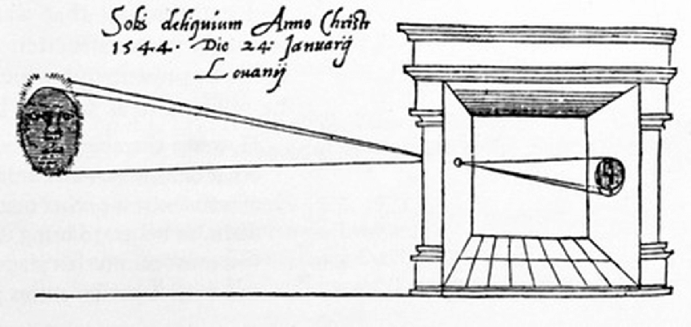
  - To study solar eclipse
  - Tiny hole where object gets projected in the back of the room
- Projection inverted (upside down) and reversed (left to right) in next image
  - By [James Ayscough](https://en.wikipedia.org/wiki/James_Ayscough) (1755)
  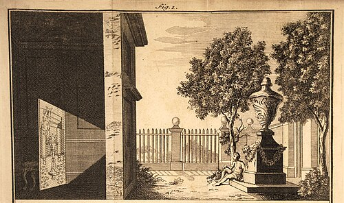
- Long History
  - inspiration for palaeolithic cave paintings?
    - All speculation, no evidence for this
  - 4th century BC - described by Chinese philosopher Mozi
  - 4th centry BC - described by Greek philosopher Aristotle
  - 1000 - described in *The Book of Optics* by **Alhazen / Ibn al-Haytham**
  - 1604 - term "camera obscura" coined by **Kepler**
  - 17th century - used for painting by Vermeer
  - 19th century - photographic camera
  - 20th century - digital camera

## Pinhole Camera
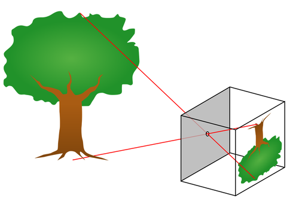

## Pinhole camera model
- "dark chamber with a pinhole in one side"

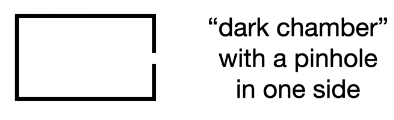
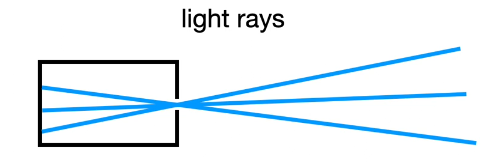
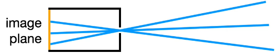
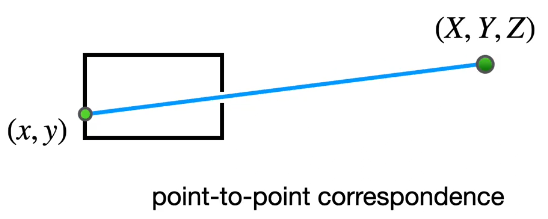
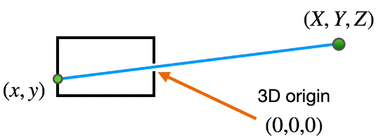
  - The center of the hole is $(0,0,0)$

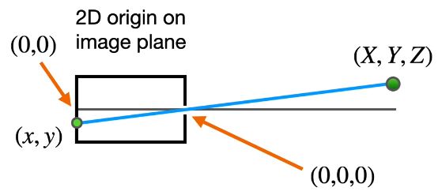
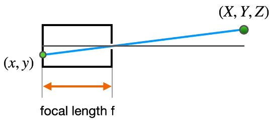
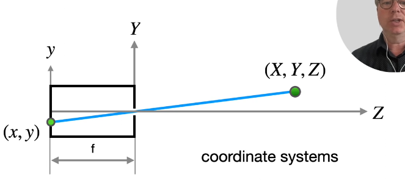
  - z going left to right
  - y going up and down
  - x and X going in and out screen
  - Capital letters for 3D coordinate systems

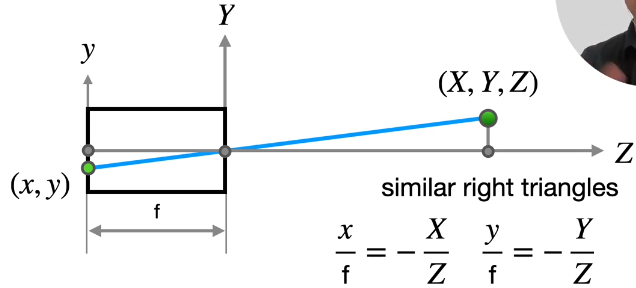
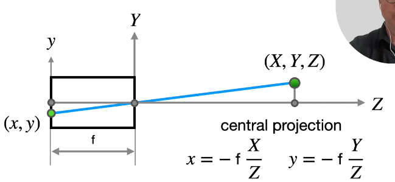
  - Lose one dimension
    - cannot go back
    - How the hell does one go back? Use AI for this?

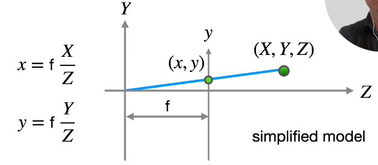
  - Basically moving image from left to middle
  - Makes it simpler and - signs disappear from equations

___

- Where do be the lens?

## Perspective Camera

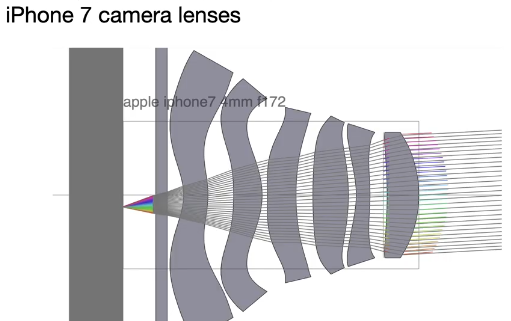
  - Counter many distortions that can happen
  - Complicated because it makes pinhole camera correct

## Straight lines project as straight lines

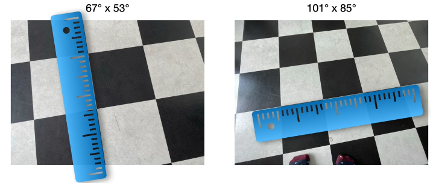
  - The rulers are overlayed after the image is taken
  - The 3D straight lines in the real world stay straight in the 2D images as seen above

## Perspective Projection
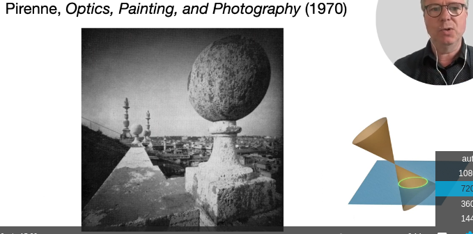
  - Off center spheres project as ellipses
  - Is a conic section
    - When sliced at image plane, get ellipse

## Spheres project as ellipses
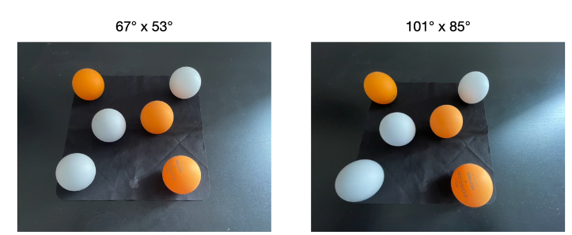
  - The wide angle camera in the left image projects the ping pong balls as ellipses

## Perspective camera
- "camera obscura" is very old concept but basis for modern cameras
- mathematics of *pinhole camera model* simple but nevertheless applicable for advanced digital cameras
- Do not like distortions from wide angle cameras
- We don't have to look at them since our computer vision systems do that for us
  - i.e. Augmented Reality apps
