## Radiance

- Pixels measure radiance
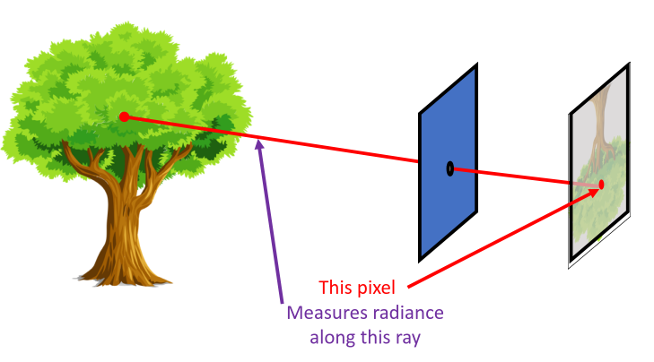

## Where do the rays come from?

- Rays from light source "reflect" off a surface and reach camera
- Reflection absorbs light energy and radiates it back
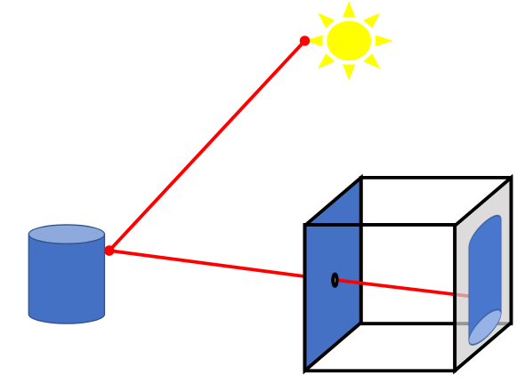
- This is absolutely far field

## Light rays interacting with a surface

- Light of radiance $L_i$ comes from light source from incoming direction $\theta_i$
- Sends out ray of radiance $L_r$ in outgoing direction $\theta_r$
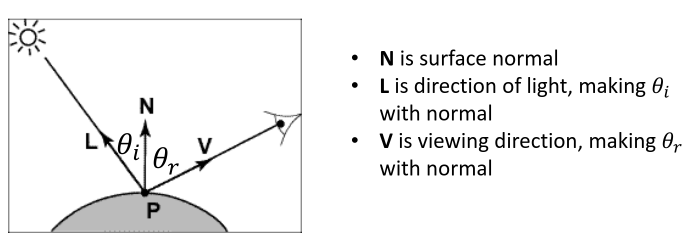
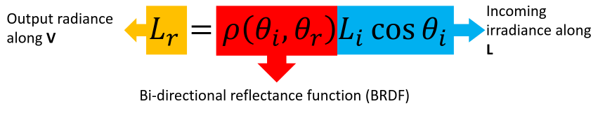
- [BDRF Wikepedia](https://en.wikipedia.org/wiki/Bidirectional_reflectance_distribution_function)
- Special cases
  - Perfect mirror
    - $\rho(\theta_i, \theta_r) = 0$ unless $\theta_i = \theta_r$
  - Matte surface
    - $\rho(\theta_i, \theta_r) = \rho_0$ (constant)

## Special case 1: Perfect mirror

- $\rho(\theta_i, \theta_r) = 0$ unless $\theta_i = \theta_r$
- Also called "Specular surfaces"
- Reflects light in single, particular direction
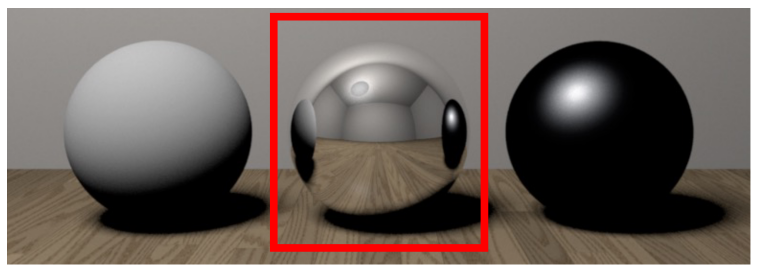
- [wikepedia perfect mirror](https://en.wikipedia.org/wiki/Perfect_mirror)
  - Reflects light perfectly
  - No transmitting or absorbing it

## Special case 2: Matte surface

- $\rho(\theta_i, \theta_r) = \rho_0$
- Also called "Lambertian surfaces"
- Reflected light is *independent of viewing direction*
  - Surface appears equally bright from all viewing directions despite incident illumination and/or geometry may vary
    - Constant radiance

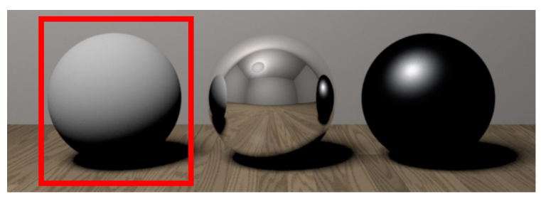
## Lambertian surfaces
$$
  \begin{equation}
    L_r = \rho L_i \cos\theta_i \rArr L_r = \rho L_i \mathbf{L \cdot N}
  \end{equation}
$$
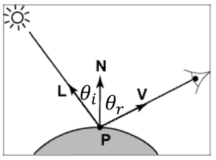
- $\rho$ is called *albedo*
  - Think of it like paint
  - High albedo: white colored surface
  - Low albedo: black surface
  - varies from point to point

- Assume light is directional: all rays from light source are parallel
  - Equivalent to a light source from infinitely far away
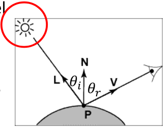
- All pixels get light from same direction $\mathbf{L}$ and of same intensity $L_i$
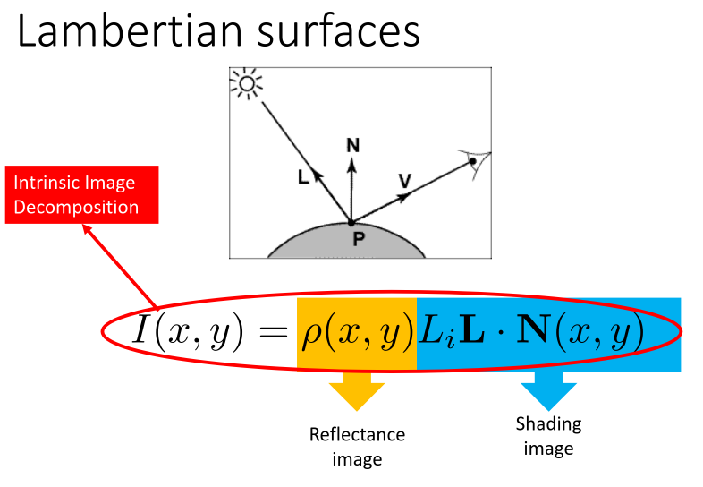

## Reconstrucing Lambertian Surfaces
$$
  \begin{equation}
    L_r = \rho L_i \cos\theta_i \rArr L_r = \rho L_i \mathbf{L \cdot N}
  \end{equation}
$$
- Equation is a constraint ot albedo and normals
- Can solve for albedo and normals?

## Solution 1: Recovery from a single image
- Step 1: Intrinsic image decomposition
  - Reflectance image $\rho(x, y)$
  - Shading image $L_i\mathbf{L \cdot N}(x, y)$
  - Decomposition relies on priors or reflectance image
- What kind of priors?
  - Reflectance image captures the "paint" on an object surface
  - Surfaces tend to be of uniform color with sharp edges when color changes  
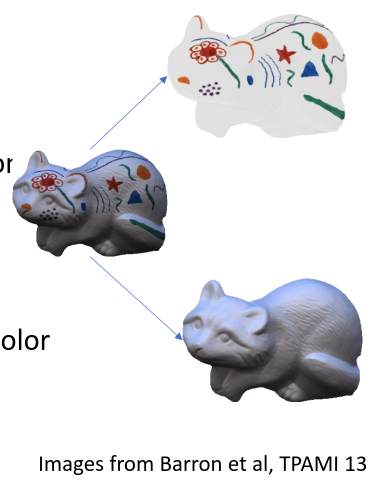
- Step 2: Decompose shading image into illumination and normals
  - $L_i \mathbf{L \cdot N}(x, y)$
  - Called Shape-From-Shading
  - Relies on priors on shape: shapes are smooth  
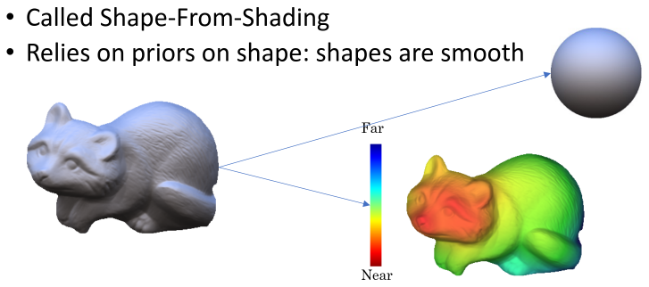

## Solution 2: Recovery from multiple images

$$
  \begin{equation}
    L_r = \rho L_i \cos\theta_i \rArr L_r = \rho L_i \mathbf{L \cdot N}
  \end{equation}
$$
- Represents an equation in the albedo and normals
- Multiple images give constraints on albedo and normals
- Called *Photometric Stereo*
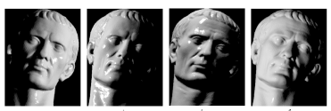

## Multiple Images: Photometric Stereo

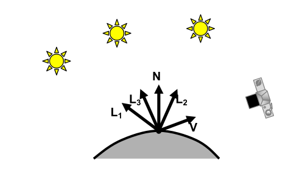

## Photometric Stereo - the math

- Gets into the math here, will have to come back to this later. I'm not ready for the crazy math behind it yet.
- Let myself make it through atleast chapter 1 of the textbook please
